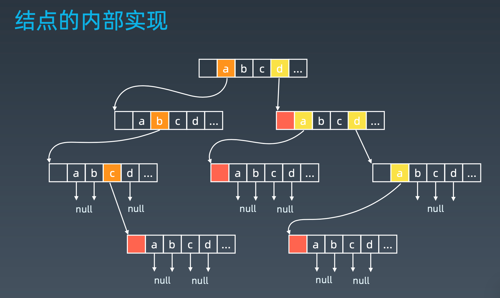
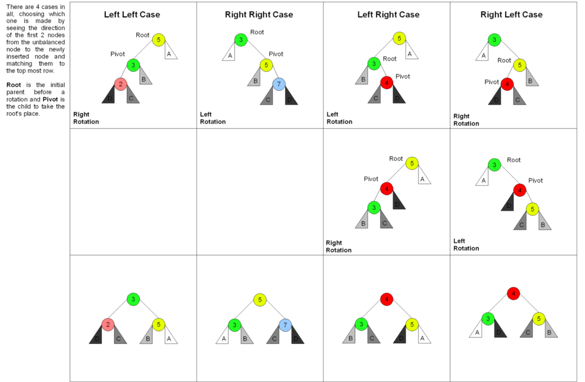

# 算法训练营
---
## 第7周：
---
### **本周内容一览：**
### 第13课 字典树和并查集：
1. Trie树(前缀树)的基本实现和特性：
    * 基本性质：
      1. 结点本身不存完整单词;
      2. 从根结点到某一结点，路径上经过的字符连接起来，为该结点对应的 字符串;
      3. 每个结点的所有子结点路径代表的字符都不相同。
    * 内部结构：
    
    * Python代码模版:

                class Trie:

                    def __init__(self):
                        """
                        Initialize your data structure here.
                        """
                        self.root = {}
                        self.end_of_word = "#"

                    def insert(self, word: str) -> None:
                        """
                        Inserts a word into the trie.
                        """
                        node = self.root
                        for ch in word:
                            node = node.setdefault(ch, {})
                        node[self.end_of_word] = self.end_of_word

                    def search(self, word: str) -> bool:
                        """
                        Returns if the word is in the trie.
                        """
                        node = self.root
                        for ch in word:
                            if ch not in node:
                                return False
                            node = node[ch]
                        return self.end_of_word in node

                    def startsWith(self, prefix: str) -> bool:
                        """
                        Returns if there is any word in the trie that starts with the given prefix.
                        """
                        node = self.root
                        for ch in prefix:
                            if ch not in node:
                                return False
                            node = node[ch]
                        return True

                # Your Trie object will be instantiated and called as such:
                # obj = Trie()
                # obj.insert(word)
                # param_2 = obj.search(word)
                # param_3 = obj.startsWith(prefix)

2. Trie树实战题目解析：单词搜索2
   * 79. 单词搜索给定一个二维网格和一个单词，找出该单词是否存在于网格中。单词必须按照字母顺序，通过相邻的单元格内的字母构成，其中“相邻”单元格是那些水平相邻或垂直相邻的单元格。同一个单元格内的字母不允许被重复使用。

3. 并查集的基本实现、特性和实战题目解析:
    * 作用：看看两个元素是不是在同一个集合中，也可以合并两个集合
    * 操作： • makeSet(s):建立一个新的并查集，其中包含 s 个单元素集合。
            • unionSet(x, y):把元素 x 和元素 y 所在的集合合并，要求 x 和 y 所在
的集合不相交，如果相交则不合并。
            • find(x):找到元素 x 所在的集合的代表，该操作也可以用于判断两个元 素是否位于同一个集合，只要将它们各自的代表比较一下就可以了。
    * 代码模版：

                def init(p):
                    # for i = 1,2,...: p[i] = i
                    p = [i for i in range(n)]
                def union(p, i, j):
                    p1 = parent(p, i)
                    p2 = parent(p, j)
                    p[p1] = p2
                def parent(p, i):
                    root = i
                    while p[root] != root:
                        root = p[root]
                    while p[i] != i: # 路径压缩
                        x = i; i = p[i]; p[x] = root
                    return root
### 第14课 字典树和并查集：
1. 剪枝的实现和特性:
   * DFS代码模版：

                # 递归：
                visited = set()
                def dfs(node, visited):
                    if node in visited: # terminator
                        return None
                    visited.add(node)
                    # process current node
                    for next_node in node.children():
                        if next_node not in visited:
                            dfs(next_node, visited)

                # 非递归：
                def dfs(root):
                    if root is None:
                        return []
                    visited, stack = [], []
                    while stack:
                        node = stack.pop()
                        visited.append(node)
                        process(node)
                        nodes = generate_related_nodes(node)
                        stack.append(nodes)
                    # other processing

    * BFS代码模版：

                def BFS(graph, start, end):
                    queue = []
                    queue.append([start])
                    visited.add(start)

                    while queue:
                        node = queue.pop(0)
                        visited.add(node)
                        
                        process(node)
                        nodes = generate_related_nodes(node)
                        queue.append(nodes)
    * 回溯法：回溯法采用试错的思想，它尝试分步的去解决一个问题。
2. 剪枝实战题目解析：数独
3. 双向BFS的实现、特性和题解:
   * 双向BFS代码模版：

                def two_ended_BFS(graph, start, end):
                    # using set:
                    front = {start}
                    back = {end}
                    # BFS starts:
                    while front:
                        next_front = set()
                        for node in front:
                            next_node = process(node)
                            if next_node in back:
                                return 
                            if next_node in graph:
                                next_front.add(next_node)
                                graph.remove(next_node)
                        front = next_front
                    if len(front) > len(back):
                        front, back = back, front

4. 启发式搜索(A*搜索)的实现、特性和题解:
    * 启发式函数: h(n)，它用来评价哪些结点最有希望的是一个我们要找的结 点，h(n) 会返回一个非负实数,也可以认为是从结点n的目标结点路径的估 计成本。启发式函数是一种告知搜索方向的方法。它提供了一种明智的方法来猜测 哪个邻居结点会导向一个目标。
    * 773.滑动谜题（微软、谷歌、Facebook 在半年内面试中考过）:https://leetcode-cn.com/problems/sliding-puzzle/
    * A* 代码模版：

                def AstarSearch(graph, start, end):
                    pq = collections.priority_queue()
                    pq.append([start])
                    visited = set(start)

                    while pq:
                        node = pq.pop() # We can add more intelligence here
                        visited.add(node)

                        process(node)
                        nodes = generate_related_nodes(node)
                        unvisited = [node for node in nodes not in visited]
                        pq.push(unvisited)
    >参考链接
    >A* 代码模板: https://shimo.im/docs/8CzMlrcvbWwFXA8r
    >相似度测量方法:https://dataaspirant.com/2015/04/11/five-most-popular-similarity-measures-implementation-in-python/
    >二进制矩阵中的最短路径的 A* 解法:https://leetcode.com/problems/shortest-path-in-binary-matrix/discuss/313347/A*-search-in-Python
    >8 puzzles 解法比较:https://zxi.mytechroad.com/blog/searching/8-puzzles-bidirectional-astar-vs-bidirectional-bfs/

### 第15课 AVL树和红黑树：
1. AVL树和红黑树的实现和特性:
    * AVL树：
      1. 发明者 G. M. Adelson-Velsky 和 Evgenii Landis
      2. Balance Factor(平衡因子): 是它的左子树的高度减去它的右子树的高度(有时相反)。 balancefactor={-1, 0, 1}
      3. 通过旋转操作来进行平衡(四种)
      4. https://en.wikipedia.org/wiki/Self-balancing_binary_search_tree
    * AVL 旋转操作：
      1. 左旋 2. 右旋 3. 左右旋 4. 右左旋
    * AVL 旋转操作-- 图解：
        
    * RedBlack Tree:
        红黑树是一种近似平衡的二叉搜索树(Binary Search Tree)，它能够确保任何一 个结点的左右子树的高度差小于两倍。具体来说，红黑树是满足如下条件的二叉 搜索树:
        • 每个结点要么是红色，要么是黑色
        • 根结点是黑色
        • 每个叶结点(NIL结点，空结点)是黑色的。
        • 不能有相邻接的两个红色结点
        • 从任一结点到其每个叶子的所有路径都包含相同数目的黑色结点。
    * RedBlack Tree VS. AVL:
        • AVL trees provide faster lookups than Red Black Trees because they are more strictly balanced.
        • Red Black Trees provide faster insertion and removal operations than AVL trees as fewer rotations are done due to relatively relaxed balancing.
        • AVL trees store balance factors or heights with each node, thus requires storage for an integer per node whereas Red Black Tree requires only 1 bit of information per node.
        • Red Black Trees are used in most of the language libraries
        like map, multimap, multisetin C++whereas AVL trees are used in databases where faster retrievals are required.

#### **漂亮代码收集：**
* 36. 有效的数独:判断一个 9x9 的数独是否有效。只需要根据以下规则，验证已经填入的数字是否有效即可.数字 1-9 在每一行只能出现一次。数字 1-9 在每一列只能出现一次。数字 1-9 在每一个以粗实线分隔的 3x3 宫内只能出现一次。

                class Solution:
                    def isValidSudoku(self, board: List[List[str]]) -> bool:
                        rows = [{} for _ in range(9)]
                        columns = [{} for _ in range(9)]
                        boxes = [{} for _ in range(9)]
                        
                        for i in range(9):
                            for j in range(9):
                                if board[i][j] != '.':
                                    num = int(board[i][j])
                                    box_index = i // 3 * 3 + j // 3
                                    
                                    rows[i][num] = rows[i].get(num, 0) + 1
                                    columns[j][num] = columns[j].get(num, 0) + 1
                                    boxes[box_index][num] = boxes[box_index].get(num, 0) + 1
                                    
                                    if rows[i][num] > 1 or columns[j][num] > 1 or boxes[box_index][num] > 1:
                                        return False
                        
                        return True

#### **Python语法注意：**
* dict: setdefault:

                # 如果node['a']存在，取出来，如果不存在创建node['a'] = {}
                node = {}
                node = node.setdefault('a', {})
#### **对代码对一些理解：**

#### **需要理解的地方：**

