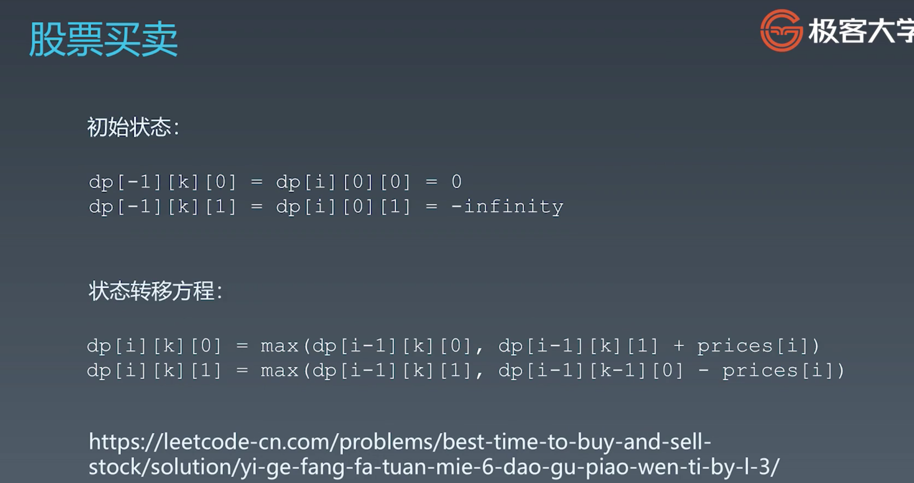

# 算法训练营
---
## 第9周：
---
### **本周内容一览：**
### 第19课 高级动态规划：
1.动态规划、状态转移方程串讲：
  * 动态规划 Dynamic Programming:
      1. “Simplifying a complicated problem by breaking it down into simpler sub-problems”
      (in a recursive manner)
      2. Divide & Conquer + Optimal substructure 分治 + 最优子结构
      3. 顺推形式: 动态递推
  * DP 代码模版：

                function DP():
                    dp = [][] # 二维的情况
                    for i = 0 , ... , m:
                        for j = 0, ... , n:
                            df[i][j] = _function(dp[i'][j'])
                    return dp[m][n]

  * 不同路径 2 这道题目(https://leetcode-cn.com/problems/unique-paths-ii/)的状态转移方程:

        #   dp方程：
        if obstacleGrid[i] == 1:
          dp[i] = 0
        else:
          dp[i] = dp[i] + dp[i-1]

        # 代码：
        class Solution:
          def uniquePathsWithObstacles(self, obstacleGrid: List[List[int]]) -> int:
              dp = [0] * len(obstacleGrid[0])
              dp[0] = 1
              for row in obstacleGrid:
                  for i in range(len(row)):
                      if row[i] == 1:
                          dp[i] = 0
                      elif i > 0:
                          dp[i] += dp[i-1] 
              return dp[-1]
  * 股票问题系列通解:https://leetcode-cn.com/circle/article/qiAgHn/
  

2. 高级动态规划题目详解:
   *  爬楼梯问题的延伸（https://leetcode-cn.com/problems/climbing-stairs/）：
      1. 增加：可以一次走3步；
      2. 增加：可以一次走n步（n为数列的形式表示）；
      3. 增加条件：不能走重复的步数。
   *  72. 编辑距离(https://leetcode-cn.com/problems/edit-distance/):
    

### 第20课 字符串算法：
1. 字符串基础知识和引申题目:
  >参考链接
  不可变字符串
  Atoi 代码示例
  >字符串基础问题
  转换成小写字母（谷歌在半年内面试中考过）
  最后一个单词的长度（苹果、谷歌、字节跳动在半年内面试中考过）
  宝石与石头（亚马逊在半年内面试中考过）
  字符串中的第一个唯一字符
  （亚马逊、微软、Facebook 在半年内面试中考过）
  字符串转换整数 (atoi) （亚马逊、微软、Facebook 在半年内面试中考过）
  >字符串操作问题
  最长公共前缀（亚马逊、谷歌、Facebook 在半年内面试中考过）
  反转字符串（亚马逊、谷歌、苹果在半年内面试中考过）
  反转字符串 II （亚马逊在半年内面试中考过）
  翻转字符串里的单词（微软、字节跳动、苹果在半年内面试中考过）
  反转字符串中的单词 III （微软、字节跳动、华为在半年内面试中考过）
  仅仅反转字母（字节跳动在半年内面试中考过）
  >异位词问题
  有效的字母异位词
  （Facebook、亚马逊、谷歌在半年内面试中考过）
  字母异位词分组（亚马逊在半年内面试中常考）
  找到字符串中所有字母异位词（Facebook 在半年内面试中常考）
  >回文串问题
  验证回文串（Facebook 在半年内面试中常考）
  验证回文字符串 Ⅱ（Facebook 在半年内面试中常考）
  最长回文子串（亚马逊、字节跳动、华为在半年内面试中常考）
2. 高级字符串算法:
  * 最长公共子序列--longest common sequence（1143. 最长公共子序列：https://leetcode-cn.com/problems/longest-common-subsequence/）：

        # DP转移方程(有强传递关系)：
        m = len(text1)
        n = len(text2)
        dp = [[0] * (n+1) for _ in range(m+1)]
        for i in range(1, m):
          for j in range(1, n):
            if text1[i-1] == text2[j-1]:
              dp[i][j] = dp[i-1][j-1] + 1
            else:
              dp[i][j] = max(dp[i-1][j], dp[i][j-1])
        return dp[-1][-1]

  * 最长公共子串----longest common substring：

        # DP转移方程(有弱传递关系，只在对角线上有传递关系，返回最大值)：
        m = len(text1)
        n = len(text2)
        dp = [[0] * (n+1) for _ in range(m+1)]
        for i in range(1, m):
          for j in range(1, n):
            if text1[i-1] == text2[j-1]:
              dp[i][j] = dp[i-1][j-1] + 1
            else:
              dp[i][j] = 0
        return max(dp)  ##重点关注
    **DP转移方程(有弱传递关系，只在对角线上有传递关系，返回最大值)**
  *  最长回文子串(https://leetcode-cn.com/problems/longest-palindromic-substring/):
      1. 暴力（O(n^3)）
      2. 枚举中心，两边扩散O(n^2)：
      3. DP方程:

        P(i, j) = True s[i,j]是回文；
                  Fasle s[i, j]不是回文。（s[i,j]指i，j的闭区间）
        P(i, j) = P(i+1, j-1) && s[i] == s[j]
  * 10. 正则表达式匹配: https://leetcode-cn.com/problems/regular-expression-matching/

        # 暴力递归：
        class Solution:
            def isMatch(self, s: str, p: str) -> bool:
                if not p: return not s
                
                first = bool(s) and p[0] in {s[0], '.'}
                
                if len(p) >= 2 and p[1] == '*':
                    return self.isMatch(s, p[2:]) or (first and self.isMatch(s[1:], p))
                else:
                    return first and self.isMatch(s[1:], p[1:])

        # 记忆递归：
        class Solution:
            def isMatch(self, s: str, p: str) -> bool:
                memo = {}
                
                def dp(i, j):
                    if (i, j) in memo: return memo[(i, j)]
                    if j == len(p): return i == len(s)
                    
                    first = i < len(s) and p[j] in {s[i], '.'}
                    
                    if len(p) - j >= 2 and p[j+1] == '*':
                        ans = dp(i, j+2) or (first and dp(i+1, j))
                    else:
                        ans = first and dp(i+1, j+1)
                        
                    memo[(i, j)] = ans
                    return ans
                
                return dp(0, 0)
  > 参考资料：
    最长子串、子序列问题
    最长公共子序列（亚马逊、字节跳动、谷歌在半年内面试中考过）：https://leetcode-cn.com/problems/longest-common-subsequence/
    编辑距离（亚马逊、字节跳动、谷歌在半年内面试中考过）：https://leetcode-cn.com/problems/edit-distance/
    最长回文子串（亚马逊、华为、字节跳动在半年内面试常考）：https://leetcode-cn.com/problems/longest-palindromic-substring/
    字符串 +DP 问题
    正则表达式匹配（Facebook、微软、字节跳动在半年内面试中考过）：https://leetcode-cn.com/problems/regular-expression-matching/
    题解： https://leetcode-cn.com/problems/regular-expression-matching/solution/ji-yu-guan-fang-ti-jie-gen-xiang-xi-de-jiang-jie-b/
    通配符匹配（Facebook、微软、字节跳动在半年内面试中考过）：https://leetcode-cn.com/problems/wildcard-matching/
    不同的子序列（MathWorks 在半年内面试中考过）：https://leetcode-cn.com/problems/wildcard-matching/
3. 字符串匹配算法：
  * 暴力法（brute force）O(mn);
  * Rabin-Karp
  * KMP
  >参考链接
  Boyer-Moore 算法: https://www.ruanyifeng.com/blog/2013/05/boyer-moore_string_search_algorithm.
  Sunday 算法: https://blog.csdn.net/u012505432/article/details/52210975
  字符串匹配暴力法代码示例: https://shimo.im/docs/8G0aJqNL86wWrPUE
  Rabin-Karp 代码示例: https://shimo.im/docs/1wnsM7eaZ6Ab9j9M
  KMP 字符串匹配算法视频: https://www.bilibili.com/video/av11866460?from=search&seid=17425875345653862171
  字符串匹配的 KMP 算法: http://www.ruanyifeng.com/blog/2013/05/Knuth%E2%80%93Morris%E2%80%93Pratt_algorithm.html
#### **漂亮代码收集：**
438. 找到字符串中所有字母异位词: https://leetcode-cn.com/problems/find-all-anagrams-in-a-string/
        class Solution:
            def findAnagrams(self, s: str, p: str) -> List[int]:
                if not s or not p: return None
                
                res = []
                p_dict = {}
                win_dict = {}
                
                for c in p:
                    p_dict[c] = p_dict.get(c, 0) + 1
                    
                len_s, len_p = len(s), len(p)
                left, right = 0, 0
                while right < len_s:
                    c = s[right]
                    if c not in p_dict:
                        win_dict.clear()
                        left = right = right + 1
                    else:
                        win_dict[c] = win_dict.get(c, 0) + 1
                        if right - left + 1 == len_p:
                            if win_dict == p_dict:
                                res.append(left)
                            win_dict[s[left]] -= 1
                            left += 1
                        right += 1
                
                return res

#### **需要理解的地方：**
* 最长公共前缀(https://leetcode-cn.com/problems/longest-common-prefix/description/),如何用Trie实现
* 300. 最长上升子序列https://leetcode-cn.com/problems/longest-increasing-subsequence/:题解：https://leetcode.com/problems/longest-increasing-subsequence/discuss/74824/JavaPython-Binary-search-O(nlogn)-time-with-explanation
        def lengthOfLIS(self, nums):
            tails = [0] * len(nums)
            size = 0
            for x in nums:
                i, j = 0, size
                while i != j:
                    m = (i + j) / 2
                    if tails[m] < x:
                        i = m + 1
                    else:
                        j = m
                tails[i] = x
                size = max(i + 1, size)
            return size

#### **疑问：**
* 如何改进下面的超时题解： 44. 通配符匹配： https://leetcode-cn.com/problems/wildcard-matching/

        class Solution:
            def isMatch(self, s: str, p: str) -> bool:
                memo = {}
                if not s and not p: return True
                
                def dp(i, j):
                    if (i, j) in memo: return memo[(i, j)]
                    if j == len(p): return i == len(s)
                    
                    first = len(s) > i and p[j] in [s[i], '?']
                    
                    if len(p) > j and p[j] == '*':
                        ans = False
                        for k in range(i, len(s)+1):
                            ans = ans or dp(k, j+1)
                    else:
                        ans = first and dp(i+1, j+1)
                    memo[(i, j)] = ans
                    
                    return ans
                
                return dp(0, 0)